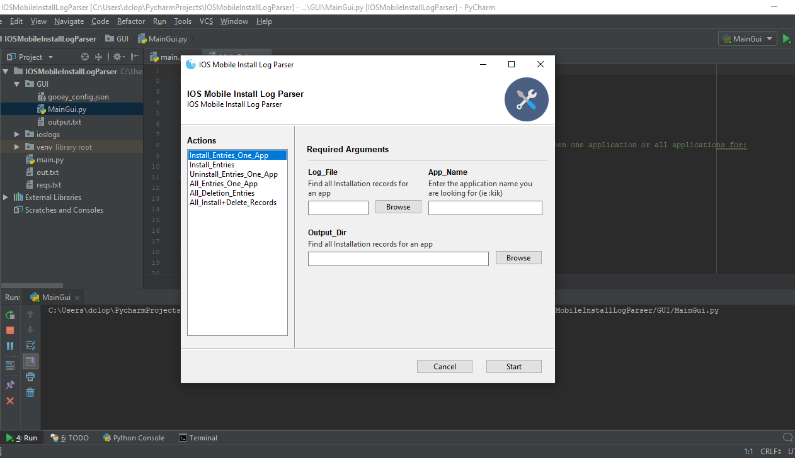

# iOSMobileInstallLogParser
 Parses iOS Mobile Installation Logs and provides output


# Descrition allows user to select the log file for exact parsing. the user can specify between one application or all applications for:
#       -install records
#       -uninstall records

## Technology Used:
 * -Python 3.6+
 * -Gooey Library


# GUI VERSION

## Setup
To run this project, install it locally using npm:

```
$ cd ../iOSMobileInstallLogParser/GUI
activate virtual environment or not
$ pip install -r reqs.txt
$ use python to start the GUI Project
```

# No GUI VERSION

## Setup
To run this project, install it locally using npm:

```
$ cd ../iOSMobileInstallLogParser
$ python main.py
follow the prompts
```

## Pictures




